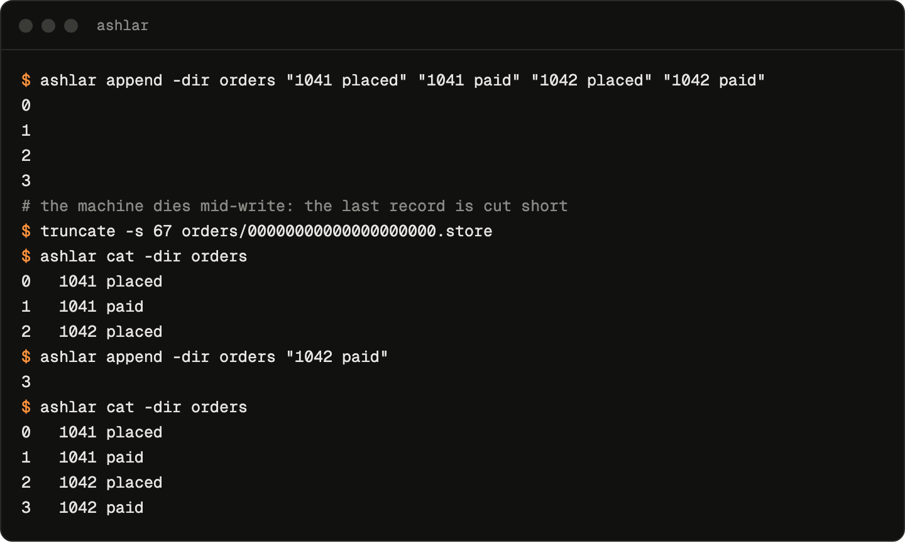

I wrote [ashlar](https://github.com/achyuta0001/ashlar) to answer one question about the storage engine underneath Kafka: what actually happens to a log when the machine dies halfway through a write? It is an embeddable, append-only commit log in Go, standard library only. It is not a broker and has never run in production. It exists so I could find out what crash recovery has to do, by having to do it.

The short answer: recovery may lose records off the end of the log. It may not refuse to open, invent a record, or hand back a damaged one. Everything below is about keeping those four promises.

## Two files per segment

A log is a directory of segments. Each segment is a pair of files named after the first offset they hold, zero-padded to 20 digits so that sorting the directory sorts the log:

- **`.store`** holds the records, back to back.
- **`.index`** maps each offset to a byte position in the store, 12 bytes per entry, so a read is an array lookup and one `pread` rather than a scan.

Every record in the store carries an 8-byte header:

```text
 0    4        8                8+n
+----+--------+-----------------+
|len | crc32c |     payload     |
+----+--------+-----------------+
```

The length alone is not enough to read a log you don't trust. After a crash the tail of the file can be a header with half a body, or a body made of whatever bytes were on the disk before. A length field says how far to read; only the checksum (CRC-32C over the payload) says that what you read is what was written. That is the difference between a short but complete record and a torn one, and recovery depends on telling them apart.

## Two ways to tear

An append writes the record to the store, then the entry to the index. A crash can land between or inside those writes:

1. **The store write landed; the index write didn't.** There are complete records on disk that nothing points at.
2. **The store write itself was torn.** The last record is a header with no body, or a body that fails its checksum.

The index can also end in a partial entry, which `newIndex` drops on open, since an entry is only meaningful if all 12 bytes are there.

## One walk fixes both

Recovery runs every time a segment opens. It doesn't try to work out *which* failure happened; one forward walk handles both:

```go
// From segment.recover, with error handling trimmed.
// Trust the index while each entry points where the store says it should,
// and the record there still verifies.
for n := 0; n < s.index.Len(); n++ {
	e, _ := s.index.Read(n)
	if e.pos != pos {
		break
	}
	width, ok := s.store.scanAt(e.pos)
	if !ok {
		break
	}
	pos += width
	valid = n + 1
}
s.index.TruncateTo(valid)

// Adopt complete records the index never learned about.
for {
	width, ok := s.store.scanAt(pos)
	if !ok {
		break
	}
	s.index.Append(uint32(valid), pos)
	pos += width
	valid++
}

// Anything left was never fully written.
s.store.Truncate(pos)
```

`scanAt` is deliberately suspicious. A record counts as intact only if its header fits in the file, its length lands inside the file, and its checksum matches. The first record that fails any of those checks is where the log ends; everything after it is cut off, and the next append goes exactly where the torn one was.

That is what this session shows: four records written, the store cut five bytes short, and on reopen the three intact records come back and the next append reuses offset 3.



## Where it refuses to guess

Truncating is only safe at the very end of the log. A torn write can only ever be the most recent one, so a short final segment is what a crash looks like. A segment *in the middle* that stops verifying before its end is something else: bit rot, a bad copy, a second process scribbling on the directory. Truncating it would quietly delete every intact record after the damage and leave a hole in the offset space.

So recovery only truncates the newest segment. Damage anywhere else makes `Open` fail with an error wrapping `ErrCorrupt`. Throwing data away is a decision for whoever owns the data, not for a library at startup.

## Testing the promise, not the cases

There are table tests for each shape of damage: a torn tail record, a checksum failure at the tail, missing index entries, a partial index entry, a garbage tail, and recovery run twice in a row. But the test that matters is a fuzz test that states the promise directly:

```go
// Condensed from FuzzRecoverTruncatedStore.
// However the store file is cut short, opening the log must succeed, and
// whatever survives must be an intact prefix of what was written.
at := uint64(cut) % (size + 1)
os.Truncate(path, int64(at))

l2, err := Open(dir, cfg)        // must not fail
st := l2.Stats()                 // must not exceed what was written
for i := uint64(0); i < st.Records; i++ {
	got, _ := l2.Read(i)         // each record must match, byte for byte
}
l2.Append([]byte("post-recovery")) // and the log must still take writes
```

It writes forty records, lets the fuzzer choose any byte to cut the file at, and checks all four promises. Table tests cover the cases I thought of. The fuzzer covers the cut points I didn't, such as inside a length field, one byte into a checksum, or exactly on a record boundary.

## What durability costs

None of this says *when* a record is safe. Recovery keeps the log consistent; the fsync policy decides how much of it exists to recover.

- **`SyncNever`:** appends go into a 64 KB write buffer inside the process. Bytes reach the kernel when that buffer fills, when a read forces a flush, or on `Sync` or `Close`. A killed process loses whatever is still in the buffer, and power loss loses whatever the kernel hadn't written out.
- **`SyncEveryN`:** every N appends (1,000 by default) the buffer is flushed and fsynced, so a crash of either kind costs at most the records since the last sync.
- **`SyncEachAppend`:** once `Append` returns, the record is on the device.

On my laptop (Apple M5, 256-byte records, `ashlar bench`):

| Policy | Records/sec |
| --- | ---: |
| `SyncNever` | ~630,000 |
| `SyncEveryN` (N = 1,000) | ~98,000 |
| `SyncEachAppend` | ~136 |

Syncing every append is more than 4,000× slower, about 7 ms per record. Part of that is macOS: Go's `File.Sync` there issues `F_FULLFSYNC`, which waits for the drive to flush its own cache rather than just handing the data to it. That is the honest version of "on the device", and it is expensive. It is also why real logs batch: one fsync for many records turns 7 ms per record into 7 ms per group.

### The bug this post found

My README said `SyncNever` records survive the process being killed. Checking that claim for this post, I appended 100 records, sent the process `SIGKILL`, and reopened the log: zero records. They had all been sitting in the write buffer. Recovery did its job: the index entries pointing past the end of the store were trimmed, and the log opened cleanly with an empty but valid prefix. The durability claim, though, was simply wrong. Every promise in this post now comes from running the code, not from reading it.

## What it doesn't do

ashlar is single-process with no file locking, has a single writer with no group commit, keeps every segment's index in memory, and re-verifies every record on every open, so startup time grows with the log. Those are listed in the README because knowing a system's limits is part of understanding it, and understanding it was the point.
